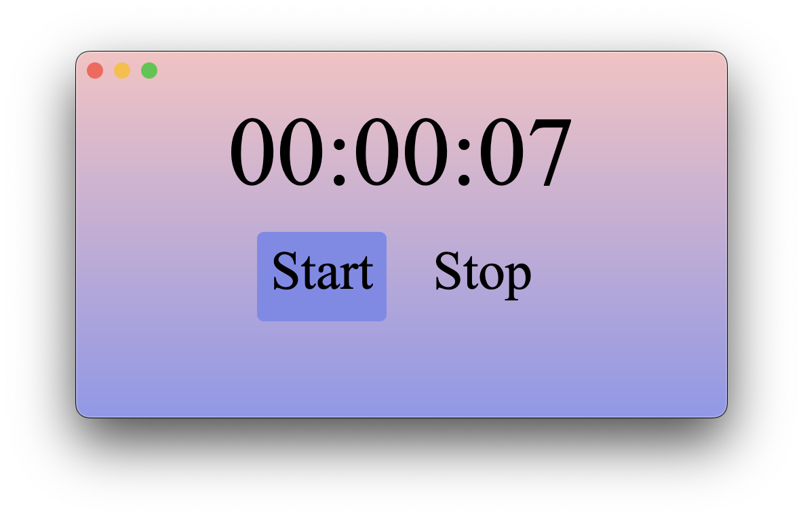

# A small timer build using HTML, CSS and JS.

I am using same demo to test servo-wry integration. You can check it here: https://github.com/atbrakhi/wry (look out for `demo-servo` branch).

# How to test it?

Follow the instructions here: https://github.com/atbrakhi/wry (in `demo-servo` branch)
